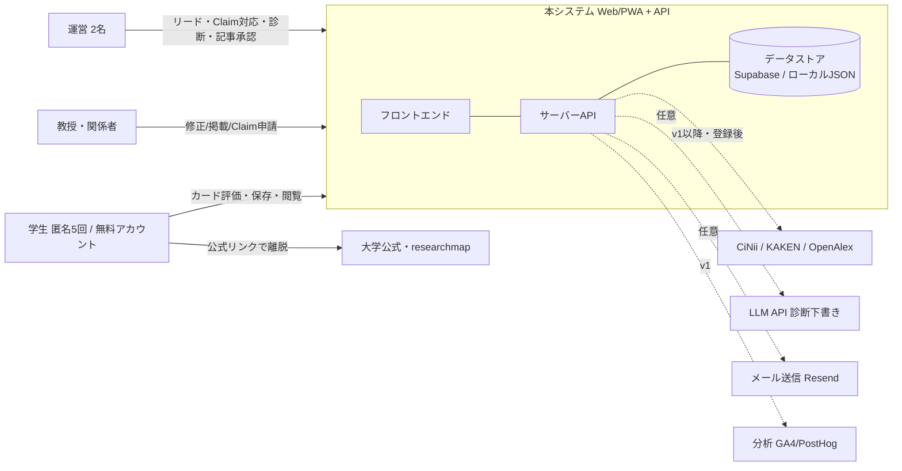

# 02 要件定義書（System Requirements Specification）

| 項目 | 内容 |
|---|---|
| 文書名 | 02 要件定義書 |
| 版数 | v1.1（Excel叩き台のID体系を維持し、ガイドラインPart 3の章構成へ昇華。追補IDは「追補」と明記） |
| 作成日 | 2026-07-03 |
| 前提資料 | docs/01_要求定義書.md／docs/00_調査考察レポート.md（矛盾を発見した場合は勝手に解決せず指摘して停止する） |
| 運用モード | ライトモード（章構成維持・各章圧縮） |

> **位置づけ宣言**：本書はGarrett UX5レイヤーにおける**Scopeレイヤー**の設計書である。システムが満たすべき条件（機能要件・非機能要件・データ要件・受入基準）を扱い、**情報構造・画面配置・実装方法は扱わない**（03の管轄）。

---

## 1. システム概要と文脈図

対象システム＝「学生向け研究テーマ探索Web/PWA」＋「運営向け管理機能」＋「サーバーAPI」。学生・教授（申請者として）・運営が直接のアクター。外部エンティティは学術API群・LLM・メール送信・（将来）分析基盤。

**システム境界**：大学公式サイト・researchmapは**参照先であり取り込み対象ではない**（本文転載禁止 K-LAW-03）。学術APIはv0では境界の外（手動整備データが一次）。人材送客・企業向け機能は境界外（PROH-05）。

## 2. 機能要件（FR：EARS形式）

各FRの属性＝ID／EARSパターン／本文／MoSCoW／検証方法／トレース元。

### 2.1 カード探索（CARD群）

| ID | パターン | 要件 | 優先 | 検証 | トレース |
|---|---|---|---|---|---|
| FR-CARD-01 | Event-driven | ユーザーが初回利用を開始したとき、システムは専門分野名ではなく日常的な関心から理解できる研究テーマカードを提示しなければならない | Must | ユーザーテスト（初回3分で10枚以上閲覧可能・保存率60%） | BR-01, STR-STU-01 |
| FR-CARD-02 | Event-driven | ユーザーがカードに対して「気になる」「違うかも」「もっと知りたい」「保存」を選んだとき、システムは選択履歴を保存しなければならない | Must | 機能テスト（AC-07：全アクション記録・再訪時復元） | BR-01 |
| FR-CARD-03（追補） | Event-driven | ユーザーが関心入口（日常ジャンル）を選択したとき、システムは以降のカード提示順を選択に応じて調整しなければならない | Should | 機能テスト | BR-01, KPI-02 |

### 2.2 興味プロファイル（PROF群）

| ID | パターン | 要件 | 優先 | 検証 | トレース |
|---|---|---|---|---|---|
| FR-PROF-01 | Event-driven | ユーザーが一定数（既定値10枚）のカードを評価したとき、システムは興味対象・研究方法の好み・基礎/応用志向・候補分野を要約して表示しなければならない | Must | ユーザーテスト/機能テスト（AC-01：納得度50%） | BR-01, STR-STU-01 |
| FR-PROF-02（追補） | Ubiquitous | システムは、プロファイルを断定表現ではなく「傾向」として表示しなければならない | Must | 画面レビュー | K-MKT-01, コピー方針 |
| FR-PROF-03（追補） | Event-driven | ユーザーがプロフィールを開いたとき、システムは傾向を「掴めて・使える」形で提示しなければならない：①あなたが興味を持ちそうな問い（反応済み研究室のAI問いの再利用・研究室リンク付き）②関心分野の内訳（比率＋研究室数）③リアクションした研究室一覧（気になる／保存／見た）④関心キーワード（タップで検索）⑤探索ログ。傾向未生成時も③⑤は先に表示する | Should | 機能テスト（FR-PROF-03a〜e） | STR-STU-01（興味の言語化）。追加AI生成なし（キャッシュ再構成のみ） |

### 2.3 研究室接続（MATCH群）

| ID | パターン | 要件 | 優先 | 検証 | トレース |
|---|---|---|---|---|---|
| FR-MATCH-01 | State-driven | ユーザーがカードまたはプロファイルを閲覧している間、システムは関連する研究室候補と**接続理由**（保存カードとの対応を含む）を表示しなければならない | Must | 機能テスト/計測（AC-09、遷移率30%） | BR-01 |
| FR-MATCH-02（追補） | Unwanted | もし関連研究室が0件ならば、システムは「近いテーマを探す」導線を表示し、行き止まりにしてはならない | Must | 機能テスト | PM-01, 供給密度不足対策 |
| FR-SEARCH-AI（追補） | Event-driven | ユーザーが検索窓に自然文（研究テーマ・分野名を含まない曖昧な興味）を入力したとき、システムは意図（分野・キーワード）を解釈して関連研究室を関連度順に提示し、解釈内容を可視化しなければならない | Should | ユーザーテスト | BR-01, STR-STU-01。LLM未設定時は辞書ベースにフォールバック（AC-05思想） |
| FR-NAME-01（追補） | Ubiquitous | システムは、外部研究者DB（researchmap/CiNii/KAKEN/Scholar）への検索リンクに、職位・括弧書き（「（教員）」等）を除去した氏名のみを渡さなければならない | Must | 機能テスト（cleanPersonName） | 外部検索の命中率。ADR-003 |
| FR-ENRICH-01（追補） | Event-driven | ユーザーが研究室ページを開いたとき、システムは公開キーワードからAIが生成した学生向けガイド（概要・問い・研究方法・向く学生・進路・面白さ）を「AI推定・本人未確認」と明示して表示しなければならない | Should | 画面レビュー | FR-LAB-01の空欄解消。ADR-004。断定禁止（NFR-DQ-01） |
| FR-ENRICH-02（追補） | Event-driven | ユーザーが研究室ページを開いたとき、システムは教員名から公開論文DB（OpenAlex）を検索し、機関一致または主分野一致かつ業績3件以上の確度が高い場合のみ論文をin-app表示しなければならない（同姓同名の注意書き必須） | Should | 機能テスト（藤本聡=物理に医学論文を出さない） | 誤同定＝致命リスク回避。ADR-004・PM-05 |
| FR-ENRICH-03（追補） | Unwanted | もしAI生成または外部論文取得が失敗したならば、システムは研究室ページの他の情報表示を継続しなければならない（充実情報はlazyロード） | Must | 異常系テスト | AC-05・画面を壊さない |
| FR-LABCARD-04（追補） | Event-driven | ユーザーがデッキで自然文検索または「傾向に沿って表示」を選んだとき、システムはAI意味検索の解釈結果／興味の傾向（プロファイル）に沿った研究室カードを提示し、根拠（解釈チップ／傾向ラベル）を可視化しなければならない。傾向未生成時は既定デッキへフォールバックし残り枚数を案内する | Should | 機能テスト（FR-LABCARD-04a〜d） | BR-01, FR-SEARCH-AI, FR-PROF-01。傾向からの研究室検索導線（/labs?ai=傾向キーワード）を含む |
| FR-CACHE-01（追補） | Ubiquitous | システムは、AI生成物（学生ガイド・論文・研究室カード）を7日間サーバーに保持して全セッションへ配信し、期限内の再生成を行ってはならない。期限切れは旧内容を配信しつつ裏で再生成する | Must | 機能テスト（2回目アクセスが即時） | トークンコスト抑制。ADR-005 |
| FR-LABCARD-01（追補） | Event-driven | ユーザーが「見つける」を開いたとき、システムは実在の研究室から生成した学生向けカード（問いかけ・身近な入口・やさしい説明・面白さ）をデッキ形式で提示しなければならない（AI作成の明示つき） | Must | 画面レビュー/機能テスト | 見つける刷新。ADR-005 |
| FR-LABCARD-02（追補） | Event-driven | ユーザーが研究室カードに「気になる」「違うかも」「保存」「もっと知りたい」を選んだとき、システムは研究室への評価として冪等に記録し、プロファイル・候補マッチングへ反映しなければならない | Must | 機能テスト（冪等・閾値合算） | FR-PROF-01/FR-MATCH-01と統合 |
| FR-LABCARD-03（追補） | Unwanted | もしAI生成が利用不能ならば、システムはテンプレートカードで即時にデッキ提供を継続しなければならない | Must | 異常系テスト | AC-05 |

### 2.4 研究室ページ（LAB群）

| ID | パターン | 要件 | 優先 | 検証 | トレース |
|---|---|---|---|---|---|
| FR-LAB-01 | Event-driven | ユーザーが研究室ページを開いたとき、システムは研究内容・学生テーマ例・研究方法・主要論文・日常・指導体制・進路・向いている/向いていない学生・共同研究相談領域・公式リンクを表示しなければならない | Must | 画面レビュー（AC-02：未確認項目は空欄でなく「未確認」表示） | BR-02, STR-STU-02 |
| FR-LAB-02（追補） | Ubiquitous | システムは、全研究室ページに出典・最終更新日・確度（verified状態）・修正依頼導線を表示しなければならない | Must | 画面レビュー（AC-02） | BR-07, NFR-DQ-01 |

### 2.5 修正依頼・Claim（CLAIM群）

| ID | パターン | 要件 | 優先 | 検証 | トレース |
|---|---|---|---|---|---|
| FR-CLAIM-01 | Event-driven | 教授または関係者が掲載内容の修正・停止・公認（Claim）を申請したとき、システムは申請を記録し、運営に通知しなければならない | Must | 機能テスト（AC-03：通知＋対応待ち記録。SLA 1営業日） | BR-07, STR-PI-02 |
| FR-CLAIM-02（追補） | Unwanted | もし申請内容が「誤情報の指摘」または「掲載停止」ならば、システムは本人確認完了前でも運営が当該ページを一時非公開にできる手段を提供しなければならない | Must | 機能テスト | STR-PI-02, PM-05 |

### 2.6 見え方診断レポート（REPORT群）

| ID | パターン | 要件 | 優先 | 検証 | トレース |
|---|---|---|---|---|---|
| FR-REPORT-01 | Event-driven | 運営が研究室（ID/URL/研究者名）を指定したとき、システムは見え方診断レポートの下書き（学生視点の不足情報・競合比較・改善案・想定カード接続を含む）を生成しなければならない | Must | レビュー（AC-04：人間編集前提の下書き） | BR-02, STR-PI-01 |
| FR-REPORT-02（追補） | Unwanted | もしLLM APIが利用不能ならば、システムは登録データに基づくテンプレート診断を生成し、下書き作成を継続できなければならない | Must | 異常系テスト | NFR-EXT-02と同旨 |

### 2.7 リード管理（LEAD群）

| ID | パターン | 要件 | 優先 | 検証 | トレース |
|---|---|---|---|---|---|
| FR-LEAD-01 | Event-driven | 運営が営業リードを登録したとき、システムは大学・専攻・研究室・URL有無・更新停止・KAKEN有無・ステータス・次アクション（日付必須）を管理できなければならない | Must | 機能テスト（AC-08：ステータス別抽出） | BR-06 |

### 2.8 記事ワークフロー（ARTICLE群）

| ID | パターン | 要件 | 優先 | 検証 | トレース |
|---|---|---|---|---|---|
| FR-ARTICLE-01 | Event-driven | 月額運用顧客の研究室について記事作成が発生したとき、システムは学生ライター原稿→運営編集→教授確認→公開の状態を管理しなければならない（差戻し理由は必須記録） | Should | 機能テスト（STATE-02全遷移） | STR-WRITER-01, BR-06 |

### 2.9 専攻ページ（DEP群）

| ID | パターン | 要件 | 優先 | 検証 | トレース |
|---|---|---|---|---|---|
| FR-DEP-01 | Event-driven | 専攻ページを表示するとき、システムは所属研究室を研究テーマ・方法・進路・カード接続・教員・募集情報で比較できるようにしなければならない | Should | ユーザーテスト（専攻関係者2/3有用） | BR-03, STR-DEP-01 |

### 2.10 認証・プライバシー（AUTH/PRIV群）

| ID | パターン | 要件 | 優先 | 検証 | トレース |
|---|---|---|---|---|---|
| FR-AUTH-01 | Event-driven | ユーザーがアカウントを作成したとき、システムはメール認証により本人の保存履歴を復元可能にしなければならない | Must（M2） | 機能テスト | NFR-PRV-01, OI-03 |
| FR-AUTH-02（追補） | State-driven | 匿名ユーザーが価値操作を5回完了した後に6回目を実行しようとしたとき、システムは閲覧状態と入力内容を失わず、無料アカウント作成またはログインを案内しなければならない。研究室・学会・ジャーナル等の公開閲覧は回数に含めず継続できる | Must（M2） | API/UIテスト（AC-11） | BR-09 |
| FR-AUTH-03（追補） | Event-driven | 匿名ユーザーが登録またはログインしたとき、システムは現在の匿名sessionIdを当該ユーザーへ紐付け、保存・評価・問い・研究プロジェクトを同じ状態から継続可能にしなければならない | Must（M2） | 機能テスト（AC-12） | BR-09, NFR-PRV-01 |
| FR-PRIV-01（追補） | Event-driven | ユーザーが自分のデータの削除を選んだとき、システムは保存履歴・プロファイル・イベントの紐付け情報を定義範囲（§4）で削除しなければならない | Must | 受入テスト（AC-06） | NFR-PRV-01, PROH-04, K-STORE-02 |

### 2.11 計測（EVT群・追補）

| ID | パターン | 要件 | 優先 | 検証 | トレース |
|---|---|---|---|---|---|
| FR-EVT-01（追補） | Event-driven | ユーザーがカード評価・プロファイル生成・研究室閲覧・公式リンククリックを行ったとき、システムはKPI算出に必要なイベント（card_action / profile_generated / lab_view / outbound_click）を記録しなければならない | Must | 機能テスト（KPI-01〜03が管理画面で算出可能） | KPI-01〜03, 検証計画M2 |

### 2.12 企業向け（ENT群）

| ID | パターン | 要件 | 優先 | 検証 | トレース |
|---|---|---|---|---|---|
| FR-ENT-01 | Event-driven | （v1以降）企業向けレポートを作成するとき、システムは技術課題から関連する研究テーマ・研究室候補・相談可能性を整理できなければならない | Could（v0実装しない） | 手動検証 | STR-ENT-01 |

### 2.13 問いクラフト（QUESTION群・追補）

| ID | パターン | 要件 | 優先 | 検証 | トレース |
|---|---|---|---|---|---|
| FR-QUESTION-01（追補） | Event-driven | ユーザーが自由入力または保存素材から問いを作るとき、システムは素材の転載・連結ではなく、対象・現象・文脈・変数または概念間関係・確かめ方を特定したリサーチクエスチョン候補を生成しなければならない | Must | 品質ゲートテスト（全候補が疑問文・類型固有・検証可能） | STR-STU-01 |
| FR-QUESTION-02（追補） | Ubiquitous | システムは、公式情報・ユーザー自身の反応/理由・AIの仮定を分離し、異質な複数素材を扱う場合は接続仮説と不足情報を明示しなければならない | Must | API/画面レビュー | NFR-DQ-01, K-MKT-01 |
| FR-QUESTION-03（追補） | Event-driven | システムが12研究成果物類型の候補を提示するとき、各類型の問いの型に従い、一般向けRQと専門向けRQを同一の意味内容で提示し、推奨は実行可能性の高い3〜4件に限定しなければならない | Must | 自動テスト＋画面レビュー | STR-STU-01 |
| FR-QUESTION-04（追補） | Unwanted | もしAI生成が失敗・タイムアウト・品質ゲート不合格ならば、システムは低品質なAI結果を表示せず、品質検査済みの仮説たたき台へ置換してその旨と再生成導線を表示しなければならない | Must | 異常系テスト | AC-05思想, NFR-EXT-02 |
| FR-QUESTION-05（追補） | Ubiquitous | システムは一般向けRQを、研究領域・学会・ジャーナルDBの問いと同程度の平易さで、初見の非研究者が対象と知りたい関係を一読で理解できる一文として提示しなければならない。専門用語、測定指標、研究手法、条件の列挙は専門向けRQへ保持する | Must | 可読性ゲート＋実出力レビュー | STR-STU-01 |
| FR-QUESTION-06（追補） | Ubiquitous | 問いクラフトの生成結果は「一般向けの問い・次の操作」を常時表示し、素材の接続根拠・仮定・専門向けRQ・調査設計は利用者が必要なときだけ開ける段階表示にしなければならない | Must | 初見利用者レビュー＋キーボード操作 | NFR-ACC-03, STR-STU-01 |

### 2.14 情報設計・可読性（UX群・追補）

| ID | パターン | 要件 | 優先 | 検証 | トレース |
|---|---|---|---|---|---|
| FR-UX-01（追補） | Ubiquitous | システムは全画面で共通の文字スケールを使い、本文16px以上、補足14px以上、索引・短いメタ情報12px以上を維持しなければならない。表紙サムネイル内の装飾文字のみ例外とする | Must | computed style監査＋200%表示 | NFR-ACC-02/04 |
| FR-UX-02（追補） | Ubiquitous | 情報量の多い画面は「見出し→一文要約→任意の詳細」の順に読み進められ、初期表示で判断に不要な根拠・設定・専門情報はネイティブな開閉UIへ収納しなければならない | Must | 主要画面レビュー＋開閉の支援技術確認 | NFR-ACC-03 |
| FR-UX-03（追補） | Ubiquitous | 本文の行長は原則68文字相当以内、和文本文の行間は1.8前後とし、文章中心カードはデスクトップでも一列あたり十分な幅を確保しなければならない | Must | viewport別の視認性監査 | NFR-ACC-04 |
| FR-UX-04（追補） | Ubiquitous | 各画面・各セクションの初期表示では主操作を原則1つに絞り、補助操作、詳細設定、専門情報は「必要な人が開く」段階表示へ収納しなければならない | Must | 初見利用者レビュー＋主要画面の操作数監査 | NFR-ACC-03, STR-STU-01 |
| FR-UX-05（追補） | Ubiquitous | 一覧は初期表示を最大8件、比較候補は推奨3〜4件を優先表示し、残りは「さらに表示」または開閉UIで段階的に提示しなければならない | Must | DOM要素数・ページ高のviewport別監査 | NFR-PF-01, NFR-ACC-04 |

## 3. 異常系・エッジケースの網羅的検討（3-4観点）

| 観点 | 検討結果（採用要件 or 対象外判断） |
|---|---|
| ネットワーク | **採用**：FR-ERR-01（Unwanted・Must）「もしネットワークが利用不能ならば、システムは閲覧済みカード・保存一覧・閲覧済み研究室ページをキャッシュから表示し、オフラインである旨を通知しなければならない」／FR-ERR-02（Unwanted・Must）「もしカード評価の送信に失敗したならば、システムは評価をローカルに保持し、復帰後に再送しなければならない（UIは楽観的更新）」 |
| プロセスライフサイクル | **採用**：リロード・タブ閉じ→匿名セッションIDはlocalStorage保持、評価履歴はサーバー永続。復帰時に状態復元（AC-07）。**対象外**：OSプロセスkill固有の対応（Webのため該当薄。ネイティブ化時に再検討） |
| 権限 | **対象外（記録）**：v0は通知・カメラ・位置情報等の権限を一切要求しない。権限UIなし |
| 割り込み | **対象外（記録）**：長時間タイマー等の中断されうる処理を持たない。ネイティブ化時に再検討 |
| データ | **採用**：空状態（カード出し切り「今日はここまで」／候補研究室0件 FR-MATCH-02／保存0件の初回導線）、不正入力（フォームバリデーション・最大長）、二重送信（FR-IDM-01（Unwanted・Must）「もし同一の操作ID（クライアント生成UUID）で二重送信されたならば、システムは1件として扱わなければならない」AC-10）、機種変更引き継ぎ＝無料アカウントの正規sessionIdを復元（FR-AUTH-03） |
| 課金 | **対象外（記録）**：v0にアプリ内課金なし（BR-05。教授課金はオフライン請求書） |
| 日時 | **軽微採用**：日時表示はJSTで統一。連続日数等の日付跨ぎ判定を持つ機能なし |
| 多環境 | **採用**：最小幅320px（iPhone SE）で破綻なし／フォントスケール200%対応。**不採用（理由つき）**：ダークモード＝v1検討（DS-02。工数対効果でv0見送り）、多言語/RTL＝対象外（国内向け） |

## 4. データ要件

| エンティティ | PII分類 | 保持期間 | 削除請求時の消去範囲 |
|---|---|---|---|
| mishiru_theme_cards / mishiru_labs / mishiru_departments / mishiru_sources | なし（公開情報・自前編集物） | 恒久（版管理） | — |
| mishiru_card_actions / mishiru_interest_profiles / mishiru_events | **個人関連情報**（匿名セッションID紐付け） | 最終利用から2年 | セッション単位で物理削除（FR-PRIV-01・即時） |
| claims | **個人情報**（氏名・所属・メール） | 対応完了後2年 | 氏名・メールをマスクし対応記録のみ残す |
| leads / reports | **個人情報**（教授名・連絡先） | 商談終了後2年 | 同上 |
| articles | 著者名（学生ライター・**個人情報**） | 契約期間＋2年 | 著者名の匿名化 |
| audit_logs | 操作者ID | 2年 | —（法令対応記録として保持） |
| auth.users / mishiru_user_sessions | **個人情報**（メール・認証ID・正規sessionId） | アカウント存続中 | 退会時に認証情報と紐付けを削除 |
| mishiru_guest_usage | **個人関連情報**（匿名sessionId・利用回数） | 最終利用から90日 | 登録引き継ぎまたは削除時に物理削除 |
| mishiru_session_state | **個人関連情報/個人情報**（匿名または認証済みsessionIdの利用状態） | 最終利用から2年 | セッションまたは退会時に物理削除 |

原則：**最小取得**（公開情報は匿名閲覧、価値操作は匿名5回まで、以降は無料アカウント）。第三者提供なし（PROH-04）。個人情報を含むテーブルは本人または管理権限のみ参照可（03権限マトリクス）。

## 5. 外部インターフェース要件

| 外部IF | v0での扱い | 障害時フォールバック | 要件ID |
|---|---|---|---|
| CiNii / KAKEN / OpenAlex | **未接続**（利用登録完了まで手動整備データが一次。K-API-01/02） | キャッシュ→手動登録データ（AC-05）。ページ表示は壊さない | NFR-EXT-01/02 |
| LLM API（OpenAI / Gemini） | 任意（検索解釈・研究室ガイド・診断下書きの文章化補助）。利用者は生成前に許可済みモデルを選択できる | テンプレート診断・辞書解釈へ自動フォールバック（FR-REPORT-02） | NFR-EXT-02準用 |
| メール送信（Resend） | 任意（Claim通知） | サーバーログ＋管理画面の対応待ち一覧で代替（AC-03は管理画面記録で成立） | FR-CLAIM-01 |
| GA4 / PostHog | v0未導入（自前イベントログで代替） | — 導入時は**外部送信一覧ページの常設**が条件（電気通信事業法 外部送信規律） | FR-EVT-01, K-LAW |

共通規律：APIキーは**サーバー側のみ**で保持（フロント露出禁止）。モデル選択は許可リスト方式とし、クライアントから任意のモデルIDを実行させない。呼び出しはキャッシュ必須・レート制限順守・出典表示。

## 6. 非機能要件（NFRカタログ全項目の採否）

### 6.1 性能（採用）
- **NFR-PF-01**（Must）：主要画面の初回表示 P95 2秒以内（モバイルWeb基準）。超過時はスケルトンUI表示。計測で確認。
- **NFR-PF-02**（Must）：カード操作へのUI応答300ms以内（楽観的更新で体感即時）。
- **NFR-PF-03**（Should・追補）：カード遷移アニメーションはフレーム落ちが体感されないこと（60fps目標。計測はM2）。
- **NFR-PF-04**（Should・追補）：API応答 P95 1秒以内（ローカルストア時は実測数十ms想定）。
- **NFR-PF-05**（Should・追補）：初回ロードのJS転送量 300KB(gzip)以下を目標。
- メモリ（3-5-1のNFR-PF-06相当）：**対象外（記録）**＝Webのため数値管理せず、リストの仮想化等で常識的範囲に抑える。

### 6.2 バッテリー・リソース（採用・方針のみ）
- ポーリング禁止（イベント駆動のみ）。位置情報・バックグラウンド通信を使用しない。

### 6.3 オフライン・同期・データ堅牢性（採用）
- オフラインで動くべき範囲＝**閲覧済みカード・保存一覧・閲覧済み研究室ページの再表示**（FR-ERR-01）。カード評価はオンライン同期（失敗時キュー FR-ERR-02）。
- 競合解決＝Last-Write-Wins（単一ユーザーの自己データのみのため十分）。
- 引き継ぎ・バックアップ＝M2無料アカウントでは正規sessionIdを復元し、匿名5回の履歴を登録時に引き継ぐ（FR-AUTH-03）。

### 6.4 アクセシビリティ（採用）
- **NFR-ACC-01**（Must）：主要操作のタッチターゲット44pt/48dp相当以上。
- **NFR-ACC-02**（Must）：通常テキストのコントラスト比 WCAG 2.1 AA（4.5:1）以上。色のみに依存した情報伝達の禁止。
- **NFR-ACC-03**（Must・追補）：全操作要素にアクセシブルネーム付与。スクリーンリーダーでコア動線（カード評価→プロファイル→研究室閲覧）が完遂可能。
- **NFR-ACC-04**（Should・追補）：フォントスケール200%でレイアウト破綻なし。
- **NFR-ACC-05**（Should・追補）：prefers-reduced-motion時はアニメーションを削減。
- **NFR-ACC-06**（Must・追補）：開閉UIはネイティブ`details/summary`または同等の支援技術対応を使い、要約は44px以上の操作領域と開閉状態の視覚表示を持つ。

### 6.5 セキュリティ・プライバシー（採用）
- **NFR-PRV-01**（Must）：学生の保存履歴・問い合わせ・プロフィール・記事原稿を目的外利用せず、削除依頼に対応（§4の範囲）。
- **NFR-SEC-01**（Must・追補）：全通信TLS。APIキー・秘匿情報のクライアント露出禁止・平文コミット禁止。
- **NFR-SEC-02**（Must・追補）：管理機能（/admin・管理API）はアクセス制御下に置く（v0=管理トークン、M2=Supabase Auth＋RLS）。学生APIはサーバーでアクセストークンを検証し、匿名回数をクライアント値だけで判定しない。
- 証明書ピンニング：**不採用（記録）**＝Webのため該当なし。ATT/IDFA：対象外（トラッキングなし）。

### 6.6 通知（不採用・理由つき）
- v0は通知を実装しない。**通知に依存しない設計を先に成立させる**（失敗パターン15対策）。PWA Pushはv1で「価値文脈でのプレ許諾」前提に再検討。

### 6.7 課金（不採用・理由つき）
- アプリ内課金なし（BR-05：学生無料。教授/専攻への請求はシステム外）。ペイウォール要件は該当なし。

### 6.8 可用性・運用・観測性（採用）
- **NFR-OPS-01**（Must）：2名運営が週数時間で回せるよう、テンプレート・状態管理・承認・通知・営業管理を標準化（制作20h以内・月次運用3h以内）。
- **NFR-AVL-01**（Should・追補）：サーバーエラーは構造化ログに記録。イベントログからKPI（保存率・完了率・遷移率）が管理画面で算出可能（FR-EVT-01）。
- 強制アップデート機構：対象外（Web。SW更新で代替）。Runbook：Claim/削除請求/障害の初動手順を03に記載。

### 6.9 ストア審査適合（ネイティブ化時に適用）
- v0はWebのため対象外。ただし**アカウント削除導線（K-STORE-02）とUGC非導入（K-STORE-01）は先行遵守**。ネイティブ化ゲートでK-STORE群を再検証。

### 6.10 データ品質・モデレーション（採用）
- **NFR-DQ-01**（Must）：研究室ページに出典・最終更新日・確度・verified状態を表示。未確認情報を断定しない。誤情報指摘時の非公開SLA 1営業日以内。
- **NFR-MOD-01**（Should）：UGC導入フェーズでは通報・ブロック・モデレーション・削除SLAを持つ（v0は自由投稿なし＝Test-PROH-03）。
- **NFR-EXT-01/02**（Must）：外部API利用時の登録・キー管理・キャッシュ・出典・フォールバック（§5）。

## 7. 受入基準（Acceptance Criteria：Must要件全件）

| ID | Given / When / Then | 対応FR |
|---|---|---|
| AC-01 | Given 学生が初回訪問した状態で、When 研究テーマカードを10枚評価する、Then システムは興味プロファイルと候補研究室を表示する（初回3分以内・5タップ以内でカード体験に到達） | FR-CARD-01, FR-PROF-01 |
| AC-02 | Given 学生が研究室ページを閲覧している、When ページ下部を確認する、Then 出典・最終更新日・修正依頼（Claim）導線が表示されている（未確認項目は「未確認」表示） | FR-LAB-01, FR-LAB-02, FR-CLAIM-01 |
| AC-03 | Given 教授が修正依頼を送信した、When 送信が完了する、Then 運営に通知され（メールまたはログ）、管理画面に「対応待ち」として記録される | FR-CLAIM-01 |
| AC-04 | Given 運営が研究室を指定した、When 診断生成を実行する、Then 不足情報・改善案・想定カード接続を含むレポート下書きが生成される（LLM不通時もテンプレートで生成される） | FR-REPORT-01, FR-REPORT-02 |
| AC-05 | Given 外部データソース（DB/API）が利用不能である、When 研究室ページ・カード一覧を表示する、Then システムはキャッシュまたは手動登録データを表示し、破綻した画面を見せない | NFR-EXT-02, FR-ERR-01 |
| AC-06 | Given 学生がデータ削除を選んだ、When 削除を確定する、Then 保存履歴・プロファイル・イベントの紐付け情報が定義範囲（§4）で削除される | FR-PRIV-01 |
| AC-07（追補） | Given 学生がカードを評価済みである、When ブラウザを再起動して再訪する、Then 保存・除外・深掘りの履歴が復元されている | FR-CARD-02 |
| AC-08（追補） | Given 運営がリードを登録した、When ステータスと次アクション日を更新する、Then ステータス別に抽出でき、次アクション日なしでは保存できない | FR-LEAD-01 |
| AC-09（追補） | Given 学生がカードを1枚以上保存している、When 候補研究室を表示する、Then 各候補に「どの保存カードとどう関係するか」の接続理由が表示される | FR-MATCH-01 |
| AC-10（追補） | Given 同一操作IDのカード評価が2回送信された、When サーバーが受理する、Then 記録は1件である | FR-IDM-01 |
| AC-11（追補） | Given 未登録ユーザーが価値操作を5回完了している、When 6回目を実行する、Then 操作は消費されず、無料登録/ログイン画面と引き継がれる内容が表示される。公開情報の閲覧は継続できる | FR-AUTH-02 |
| AC-12（追補） | Given 未登録ユーザーに保存・評価履歴がある、When 無料登録またはログインを完了する、Then 同じsessionIdまたはアカウントの正規sessionIdで履歴を継続でき、以後の価値操作に匿名上限を適用しない | FR-AUTH-01/03 |

## 8. スコープIN/OUT（v0）とPROH不存在テスト

**IN**：カード探索・プロファイル・研究室接続・研究室ページ・Claim・診断レポート・リード管理・記事ワークフロー（基本）・専攻ページ（基本）・計測・データ削除・PWA最小構成・M2無料アカウント・匿名5回体験・履歴引き継ぎ。

**OUT（今フェーズでは作らない）**：外部学術API本番接続（登録後）／通知／ダークモード／多言語／ネイティブアプリ／企業向け（FR-ENT-01）／人材送客（恒久かつ法務前提）。

**PROH不存在テスト（リリース前ゲート項目）**：

| ID | 検査内容 | 方法 |
|---|---|---|
| Test-PROH-01 | LP・アプリ内コピーに「Tinder/ランキング/教授評価/口コミ」等の禁止表現が存在しない | 全文grep＋画面レビュー |
| Test-PROH-02 | 全国網羅・口コミDBを主商品と示す導線・文言が存在しない | 画面レビュー・ロードマップレビュー |
| Test-PROH-03 | 自由口コミ投稿フォーム・評価スコア入力UIが存在しない | コード・画面レビュー |
| Test-PROH-04 | 学生の保存履歴・プロフィールを教授・企業へ渡すコード・エクスポートが存在しない | コードレビュー |
| Test-PROH-05 | 人材送客・企業への学生紹介機能が存在しない | コード・画面レビュー |

## 9. トレーサビリティマトリクス

| 上位ID | 対応FR/NFR | 対応仕様（03） | AC | KPI |
|---|---|---|---|---|
| BR-01 | FR-CARD-01/02/03, FR-PROF-01/02, FR-MATCH-01/02, NFR-PF-01/02 | SCR-01/02/03, FLOW-01 | AC-01, 07, 09 | KPI-01/02/03 |
| BR-02 | FR-LAB-01/02, FR-REPORT-01/02, FR-CLAIM-01/02 | SCR-04/05/06, FLOW-02 | AC-02, 03, 04 | KPI-04 |
| BR-03 | FR-DEP-01 | SCR-08, FLOW-03 | （M3で追加） | KPI-06 |
| BR-04 | PROH-02（不存在） | NA-02 | Test-PROH-02 | — |
| BR-05 | スコープOUT | NA-03 | Test-PROH-05 | — |
| BR-06 | FR-LEAD-01, FR-ARTICLE-01, NFR-OPS-01 | SCR-07, STATE-02/03 | AC-08 | KPI-05 |
| BR-07 | FR-LAB-02, FR-CLAIM-01/02, NFR-DQ-01 | SCR-04/06 | AC-02, 03 | 誤情報SLA |
| BR-08 | NFR-PRV-01, NFR-SEC-01/02, NFR-EXT-01/02, NFR-MOD-01, FR-PRIV-01 | API仕様・権限 | AC-05, 06 | 法務チェック |
| KPI-01〜03 | FR-EVT-01 | 管理画面KPIビュー | — | 全学生KPI |

**孤立チェック**：トレース元のないFRなし／対応FRのないBRなし（BR-03/05はShould/スコープ定義で充足）。

## 10. 未決事項（Open Issues）

| ID | 論点 | 期限 |
|---|---|---|
| OI-06 | カード評価キューの再送上限とTTL（オフライン長期化時） | 実装中に確定（03既定値へ） |
| OI-07 | 診断レポートの標準章立ての営業検証（M0の反応で改訂） | M0 |
| OI-08 | イベントログの匿名化集計の粒度（日次/週次） | M2 |
