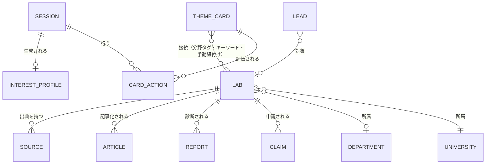

# 03 仕様書（System Specification：Structure / Skeleton / Surface）

| 項目 | 内容 |
|---|---|
| 文書名 | 03 仕様書（SPEC.md統合） |
| 版数 | v1.1 |
| 作成日 | 2026-07-03 |
| 前提資料 | docs/01_要求定義書.md／docs/02_要件定義書.md（矛盾を発見した場合は実装せず報告する） |
| 対象フェーズ | M0〜M2（Web/PWAモバイルファーストMVP） |
| 運用モード | ライトモード（章構成維持・各章圧縮） |

> **位置づけ宣言**：本書はStructure（IA・遷移・データ・API）を言葉と図で固定し、Skeleton/Surfaceをデザイン仕様（§8）として言語化・固定する。実装はすべて本書に準拠する。**本書にない機能は実装しない**（提案はまずdocs更新として行う）。

---

## 1. システム構成・技術スタック（選定理由つき）

| 層 | 採用 | 選定理由 |
|---|---|---|
| フロントエンド | **React 19 + Vite 6 + TypeScript + Tailwind CSS 4 + react-router 7** | プロトタイプ資産の継続（ADR-001）。AIとの相性（学習データ量・定型性）。SPA+PWAで要件充足 |
| アニメーション | **motion（Framer Motion後継）** | 既存依存。カード遷移のみに限定使用 |
| サーバー | **Express（TypeScript, tsx実行）** | 既存資産。APIキー秘匿・キャッシュ・冪等性の実装点 |
| データストア | **ローカルJSONストア（開発フォールバック）／Supabase PostgreSQL（M2本番）** | Vercel Functionsの非永続ファイルシステムでは可変データをSupabaseへ保存する。schema.sqlは本リポジトリで管理 |
| LLM | **OpenAI Responses API / Gemini GenerateContent API・任意** | 検索解釈・研究室ガイド・診断下書き。サーバー側の許可リストからモデルを選択し、未設定・障害時は決定的フォールバック（FR-REPORT-02） |
| メール | **Resend・任意** | Claim通知。未設定時はログ＋管理画面記録（AC-03成立） |
| ホスティング | ローカルNode環境／M2本番はVercel（Vite静的配信＋Express Function） | APIは単一Function、SPAはdist配信。可変ファイルをデプロイ領域へ書き込まない |

**注**：Excel叩き台のNext.js案は**非採用**（NA-04・ADR-001）。プロトタイプ資産の放棄コスト＞SSRの便益（MVP段階）。SEO流入KPIが未達の場合に再評価する。

## 2. Information Architecture

### 2.1 オブジェクトモデル



ユーザー表示用語と実装用語を分ける（§12用語集）。例：ThemeCard＝「研究テーマカード」、InterestProfile＝「興味の傾向」、Claim＝「修正・掲載のご依頼」。

### 2.2 ナビゲーション構造（IA-02）

- **ホーム（`/`）＝研究室をさがす（`/labs`）**。全国データの検索・発見を主入口にする（実データ投入後の方針変更・ADR-003）。
- **学生向け＝下部タブ4つ**（モバイル）：①さがす `/labs`（＝ホーム）②見つける `/discover`（カード体験）③保存 `/saved` ④プロフィール `/profile`。コア動線は2階層以内。
- md以上の画面幅ではタブをヘッダーナビに昇格（同一4項目）。
- 補助導線（フッター）：研究室運営者の方へ `/for-labs`／掲載ポリシー `/policy`／修正・掲載のご依頼 `/claim`。
- **運営向けは別系統** `/admin/*`（学生導線に露出しない）。
- **検索はタブにしない**：検索は「研究室」タブ内の補助機能（PROH-02：検索DBを主商品に見せない）。

### 2.3 User Flow

**初期バージョン（M0〜M2実装範囲）**：

```mermaid
flowchart TD
  LP[初回訪問 /discover] --> OB{初回?}
  OB -->|Yes| G[関心入口の選択（1タップ・スキップ可）]
  OB -->|No| DECK
  G --> DECK[カード提示（1枚ずつ）]
  DECK -->|気になる/違うかも/保存| DECK
  DECK -->|もっと知りたい| CD[カード詳細]
  CD --> DECK
  CD --> LABP
  DECK -->|10枚評価| PROF[興味プロファイル生成通知 → /profile]
  PROF --> CAND[候補研究室＋接続理由]
  CAND --> LABP[研究室ページ]
  LABP -->|公式リンク| OUT[大学公式/researchmap（外部）]
  LABP -->|修正・掲載依頼| CLAIM[/claim フォーム]
  DECK -->|カード出し切り| EMPTY[空状態：保存一覧・候補研究室へ誘導]
  DECK -.->|オフライン| OFF[キャッシュ表示＋オフライン通知]
  CAND -.->|0件| ZERO[近いテーマを探す導線（FR-MATCH-02）]
```

- **コア動線のf計測定義**（AC-01の解釈を固定）：コンテンツ評価タップ（カード評価10回）を除く**遷移タップ5回以内**・初回訪問から**3分以内**にプロファイル＋候補研究室へ到達。実装値：ジャンル選択1→（評価10）→自動遷移提案1→候補研究室閲覧1＝遷移3タップ。
- **教授営業フロー（FLOW-02・運営）**：リード登録→診断下書き生成→人間編集→送付記録→面談→Claim/受注→ページ制作（draft→review_requested→published/claimed）→教授確認→公開。
- **専攻フロー（FLOW-03）**：専攻ページに所属研究室を束ね、比較表を公開。

**M2公開フロー**：上記の閲覧と価値操作を匿名で開始→価値操作5回までは継続→6回目でSCR-12を開く→無料登録/ログイン→匿名sessionIdをアカウントへ引き継ぐ→以後は無料で継続。PWA Push・学術API自動候補生成・企業向けレポートは将来。

## 3. 画面仕様

**全画面共通**：5状態（通常・ローディング・空・エラー・オフライン）を定義。ローディングはスケルトンUI（NFR-PF-01）。エラーは再試行ボタンつきメッセージ。オフラインはバナー＋キャッシュ表示（FR-ERR-01）。

**AIモデル選択**：PCはサイドレール、モバイルは「すべて」メニューにモデル選択を常設する。選択値は端末に保存し、AIを使うAPI呼び出しの `X-MISHIRU-AI-MODEL` ヘッダーで送る。サーバーは許可済みモデルだけを受理し、APIキーは返さない。OpenAI Responses APIには `store: false` を明示し、MISHIRU側の必要なキャッシュ以外へ生成内容を保持させない。

**初見時の情報設計**：各画面のファーストビューは「現在地を示す見出し」「一文の説明」「主操作1つ」を基本単位とする。補助入力、絞り込み、表示設定、根拠、専門情報は開閉UIへ収納する。検索一覧は8件ずつ、問い候補は推奨3〜4件を先に表示し、残りを段階表示する。モバイルでは下部ナビゲーションと競合する常設操作を増やさず、44px以上の主操作を優先する。

| ID | 画面 | ルート | 目的 |
|---|---|---|---|
| SCR-00 | 初回オンボーディング | /discover 上のオーバーレイ | 関心入口の選択（f最小：1タップ・スキップ可） |
| SCR-01 | 見つける（カードデッキ） | /discover | カード評価でコア価値体験を開始する |
| SCR-02 | カード詳細 | /cards/:id | カードの背景（やさしい説明・方法・向いている人・関連研究室）を知る |
| SCR-03 | プロフィール | /profile | 興味の傾向・候補研究室・データ管理 |
| SCR-03b | 保存 | /saved | 保存カードの再訪・候補研究室への導線 |
| SCR-04 | 研究室ページ | /labs/:id | 必須10項目＋出典・更新日・修正依頼（FR-LAB-01/02） |
| SCR-04b | 研究室をさがす（ホーム） | /labs | **AI意味検索ボックス**（自然文→研究室・FR-SEARCH-AI）＋多軸フィルタ（大学/分野12/地域→都道府県/設置区分/職位/規模/専攻） |
| SCR-04c | 大学から探す | /universities | 100大学を地域別・件数つきで一覧 |
| SCR-04d | 大学まとめ | /universities/:name | 設置区分・都道府県・研究室数・専攻別の研究室一覧 |
| SCR-05 | 診断レポート | /admin/reports | 見え方診断の生成・編集・送付管理 |
| SCR-06 | 修正・掲載依頼 | /claim | Claim/修正/停止の受付（SCR-06） |
| SCR-07 | 運営管理 | /admin/* | KPI・リード・Claim・記事・カード・研究室状態 |
| SCR-08 | 専攻ページ | /departments/:id | 研究室の比較（FR-DEP-01） |
| SCR-09 | 研究室運営者向け | /for-labs | 診断・制作・運用の案内（営業導線） |
| SCR-10 | 掲載ポリシー | /policy | 掲載方針・出典・削除窓口・運営者情報 |
| SCR-11 | 研究にしてみる（問いクラフト） | /questions | 自由入力・保存素材を、比較可能な12類型の検証可能なRQと研究骨子へ変換する |
| SCR-12 | 無料アカウント | 全画面共通モーダル | 匿名5回後も、保存・評価・問いを失わず無料で続ける |

### SCR-12 無料アカウント

- **表示契機**：匿名利用者が6回目の価値操作を実行したとき。ヘッダー/メニューの「ログイン」から任意に開くこともできる。
- **価値操作**：自然文検索の実行、カード/研究室/研究資源への評価・保存、関心分析、問いクラフト生成。公開研究室・研究領域・学会・ジャーナル・保存済み内容の閲覧は消費しない。
- **表示内容**：残り回数、無料であること、引き継がれる内容（保存・評価・問い・研究プロジェクト）、登録とログインの切替、メール、パスワード、閉じる操作。
- **確定コピー**：見出し「続きは、無料アカウントで。」／本文「これまでの保存や問いを引き継いで、このまま無料で続けられます。」／主操作「無料でアカウントを作る」／副操作「ログインする」／閲覧継続「閉じて、見るだけ続ける」。
- **状態**：入力、送信中、確認メール案内、ログイン成功、エラー。入力中の画面内容を破棄せず、成功後は遮断された操作を利用者が再実行できる。

### SCR-11 研究にしてみる（問いクラフト）

- **生成順序**：①素材統合（公式情報／本人の理由／AI仮定を分離）→②対象・現象・文脈・知りたい関係の分解→③研究マップと領域シフト→④12類型ごとのRQ生成→⑤品質ゲート→⑥比較・採用→⑦研究骨子。
- **RQ品質ゲート**：全候補を疑問文とし、対象と文脈、類型固有の関係・比較・変化・測定・設計のいずれか、収集可能な証拠を含める。「素材文＋〇〇の視点から何を明らかにできるか」「〇〇研究として捉える」など、類型名だけを差し替えた候補は禁止する。
- **一般向けRQ**：研究領域・学会・ジャーナルDBの `questions` を文体参照にする。原則20〜88文字、一つの中心関係だけを問う。初見で説明できない専門語、略語、測定指標、数値条件、研究手法名、三項以上の列挙は表面から外し、日常語へ言い換える。例：「記号と基本ルールから、どのような結論を正しく導けるのか？」。一般向けと専門向けは同じ研究上の関心を保つが、語彙と情報密度は一致させない。
- **専門向けRQ**：対象、変数・概念、比較条件、文脈、評価指標、証拠を研究者が検討できる精度で保持する。一般向けへの翻訳後も、専門情報を削除しない。
- **異質素材**：無関係に見える素材を単純連結せず、接続仮説・採用した焦点・不足情報を表示する。本人の理由メモがある場合は公式説明より優先する。
- **AI障害時**：品質未検査の出力を表示しない。決定的生成による「仮説たたき台」を表示し、AI生成ではないこと、仮定、再生成導線を明示する。
- **比較カード**：「初めて読む人向け」と明示した一般向けRQを主見出しとし、専門向けRQ、問いの構成（対象／着目する関係／文脈／必要な証拠）、分かること、方法、成果物、実行可能性、推奨理由を展開表示する。
- **候補の段階表示**：初期表示は推奨3〜4件だけとし、残りの類型は「ほかの問い案を見る」から展開する。自由入力も「最近気になっていること」を主入力にし、違和感・理由・参考情報等は任意入力として展開する。

### SCR-01 見つける（中核画面）＝研究室カードデッキ（ADR-005で刷新）

- **デッキの中身**：実在の研究室（全国19,785件）から、AIが生成した学生向けカード。文面＝問いかけtitle（25字）・身近なhook（12字）・やさしいsummary（60〜90字）・**この分野が挑む問いquestions（3問・核心/応用/未来の3視点）**・**この分野の面白さwhy（50〜70字）**（見出し名は研究室ページのAIガイドと統一）。**8枚を1回の選択中AIモデル呼び出しでバッチ生成し、7日TTLでサーバーキャッシュ（全セッション共有）**。不通・未生成時はテンプレートカードで即時提供（FR-LABCARD-03）。
- **表示要素**：進捗（評価枚数/あと◯枚）／カード（山型スタック）：大学・専攻・hookチップ・分野チップ・問いタイトル・summary・**「この分野が挑む問い」（Q.形式・最大3）**・**「この分野の面白さ」**・研究室名/PI・**「AIが公開情報から作成（本人未確認）」の明示**・「研究室ページを見る」。
- **操作**：ボタン「違うかも」「気になる」（下部固定・44px以上）／「保存」／「研究室ページを見る」（=deepシグナル記録→SCR-04へ）。評価は`lab_actions`に冪等記録し、プロファイル・マッチングへ統合（FR-LABCARD-02）。
- **出題順（既定デッキ）**：週次共有ウィンドウ（ADR-005）＝週シードの共有プール先頭240件×ジャンル3:1から、興味分野スコアでウィンドウ内並べ替え・同一分野はバッチ内3件までの多様性ガード。残り3枚でクライアント先読み＋サーバーは次バッチをプリウォーム。
- **デッキの3モード（FR-LABCARD-04）**：
  1. **既定**：上記の週次共有ウィンドウ。
  2. **AI検索**（`q`）：デッキ上部の検索行に自然文（例「宇宙とロボット」）→ さがすタブと同じ意味検索（smartSearch）で絞り込み、解釈チップ（分野・キーワード）とヒット数をバナー表示。未評価のみ提示。
  3. **傾向に沿う**（`mode=profile`）：興味の傾向（プロファイル）→ matchLabs上位から多様性ガードつきで提示。バナーに傾向ラベル＋**「この傾向で研究室をさがす」**（→ `/labs?ai={profileQuery（候補分野キーワード）}`）。傾向未生成時は既定デッキへフォールバックし「あと◯枚」を案内。トグルは閾値未達時タップでトースト案内。
- **状態**：通常／ローディング（スケルトン＋「AIが研究室カードを準備しています…」）／空＝モード別（既定:「今日のカードはここまで」＋保存・候補導線／検索・傾向:「出し切りました」＋解除・研究室検索導線）／エラー（再試行）／オフライン（キュー保持表示 FR-ERR-02）。
- **遷移**：合計10枚評価（テーマ＋研究室の合算）でトースト「興味の傾向がまとまりました」。
- **確定コピー**：ヘッダー「見つける」／サブ「気になる研究室を集めると、あなたの興味の傾向が見えてきます」。
- **テーマカード（100枚）の扱い**：デッキの主役から退き、マッチング語彙・ジャンル定義・カード詳細（SCR-02）として存続。

### SCR-02 カード詳細

- 要素：カード全文（問い・やさしい説明・何が面白いか・使う研究方法・向いている人）／関連する論文・研究課題（出典つき・v0は手動整備分のみ）／**関連研究室候補＋接続理由**（FR-MATCH-01）／評価ボタン一式。
- 0件分岐：関連研究室0件→「近いテーマを探す」（同分野の別カードへ FR-MATCH-02）。

### SCR-03 プロフィール（v2＝傾向を「掴めて・使える」ページ。FR-PROF-03）

- **構成順**：①傾向サマリー（ヒーローカード＋「この傾向で研究室をさがす」CTA）→②**あなたが興味を持ちそうな問い**（反応済み研究室のAI問いを最大6件再利用。各行タップで研究室ページへ。出典注記つき）→③**関心分野の内訳**（上位5分野の比率バー＋「気になる研究室◯件」）→④研究方法・基礎/応用（テーマカード評価がある場合のみ）→⑤**リアクションした研究室**（気になる／保存／見た のタブ切替・3件表示＋「すべて表示」展開）→⑥**関心キーワード**（タップで `/labs?ai=` 検索）→⑦候補研究室（接続理由つき）→⑧探索ログ（評価/気になる/保存/見た の4指標）＋次のアクション→⑨データ管理（AC-06）。
- **データ源**：すべて評価履歴＋キャッシュ済みAI生成物の再構成（**追加AI生成なし・コストゼロ**）。/api/profile の extras フィールド。
- **断定禁止**：見出しは「あなたの興味の傾向（現時点）」、本文は「〜の傾向があります」（FR-PROF-02）。
- **傾向未生成時**：進捗バー（aria-progressbar）＋「あと◯枚」案内を出しつつ、**リアクション一覧と探索ログは先に表示**（評価の価値が最初の1枚から見える）。
- a11y：セクション見出しにaria-labelledby、タブにrole=tablist/aria-selected、バーは数値併記（色のみ禁止）、全タップ44px。

### SCR-04 研究室ページ

- 構成順：ヘッダー（大学・専攻・研究室名・PI・教員数・分野・verifiedバッジ）→「あなたとの接続」（保存カード由来の接続理由。セッションにプロファイルがある場合のみ）→研究内容→学生テーマ例→研究方法→主要論文→日常→指導体制→進路→向いている/向いていない学生→共同研究相談領域→公式リンク→**この教員の論文・研究成果を外部DBで探す**（researchmap/CiNii/KAKEN/Google Scholarへ教員名で橋渡し。論文検索は巨人に委ね、着地点＝研究室のリアルで差別化。ADR-003）→**出典・最終更新日・確度・修正依頼導線**（フッター固定カード AC-02）。
- **未確認項目は非表示にせず「未確認」表示**＋注記「本人確認前のため、公開情報から確認できた項目のみ掲載しています」。
- 状態：published/claimed=通常表示。hidden=404相当（「このページは現在非公開です」）。draft/review_requested=運営プレビューのみ。
- 公式リンククリックは outbound_click イベント記録（FR-EVT-01）。

### SCR-06 修正・掲載依頼フォーム

- 入力：依頼種別（内容の修正／掲載停止／公認・情報充実の相談／その他）・対象研究室（URLから自動セット）・氏名・所属・メール・内容・（任意）確認資料URL。
- バリデーション：必須項目・メール形式・最大長。二重送信防止（送信中disabled＋冪等キー）。
- 完了画面：「受け付けました。1営業日以内に運営が確認します」＋受付番号。
- 注記：「掲載停止・誤情報のご指摘は、本人確認の完了前でも一時非公開の措置を優先します」（FR-CLAIM-02）。

### SCR-07 運営管理（/admin）

- サブ画面：KPI（保存率・完了率・遷移率・カード別成績）／リード（STATE-03かんばん・次アクション日必須）／Claim（対応待ちキュー・SLA経過表示・「一時非公開」ボタン）／診断レポート（生成→編集→状態管理）／記事（STATE-02ボード・差戻し理由必須）／カード一覧（評価集計）／研究室（状態変更 STATE-01）。
- 認可：`ADMIN_TOKEN`設定時はトークン必須（未設定時は開発モードとして警告表示）。§7参照。

（SCR-00/03b/04b/05/08/09/10の詳細要素・状態は同粒度で実装。省略分の共通規則：空状態には必ず「次の行動」ボタンを置く）

## 4. 状態遷移仕様

### STATE-01 Lab.status
`draft → review_requested → published → claimed → update_requested → (claimed) `、全状態から `hidden`（緊急非公開・Claim起点）、`hidden → published|claimed`（復帰）、終端 `archived`。
- 到達不能・脱出不能なし（hiddenは復帰可、archivedのみ終端）。
- 表示規則：published/claimed のみ公開。claimedはverifiedバッジ。update_requested は公開継続＋運営タスク化。

### STATE-02 Article.status
`idea → assigned → draft → editing → professor_review → approved → published`、`professor_review → editing`（**差戻し理由必須**）、任意時点 `rejected`／`archived`。

### STATE-03 Lead.status
`new → diagnosed → contacted → meeting → proposal → won | lost`、`won|lost → nurture`、`nurture → contacted`。**全遷移で次アクション日必須**。

### Claim.status
`pending → in_review → resolved | rejected`。pendingのSLA起点はcreated_at（1営業日）。

### Report.status
`draft → edited → sent → negotiating → won | lost`。

## 5. データ仕様

- 正式スキーマ：`supabase/schema.sql`（本書と同期）。既存Supabaseプロジェクトの汎用テーブルと衝突しないよう、全テーブルを `mishiru_` 接頭辞で分離し、`mishiru_user_sessions` / `mishiru_guest_usage` / `mishiru_session_state` を持つ。全DDLはSupabase SQL Editorで再実行可能とする。
- ローカルJSONストア（既定）：マスタ＝`data/labs.json`（**全国19,785研究室**・約24MB）・`data/cards/*.json`（リポジトリ管理）、可変データ＝`data/runtime/*.json`（gitignore。デバウンス書き込み）。
- **全国データのパイプライン**（ADR-003）：`scripts/convert-national.ts` がCSV（第1回〜46回統合・19,785件）を正規化。派生列＝研究科/専攻分割・pi_name/title・member_count・keyword_tags・URL正規化・has_url、大学マスタ（`shared/universities.ts` 100大学）由来の prefecture/region/university_type、分野大分類 field_major（`shared/fields.ts`）。全大学突合・分野未分類1.8%を保証。
- **分野は二層**：field_major（12大分類・フィルタ用）と area_tags（15細分・カードマッチング用）を併存。
- 起動時に検索インデックス（研究室ごとの小文字化検索文字列）を構築し、20k件でも毎リクエストのlowerを避ける（NFR-PF-01）。
- PII分類・保持期間・削除範囲は02 §4を正とする。削除API（AC-06）はセッション単位で card_actions / interest_profiles / events を物理削除。
- 本番方針：Vercelでは匿名/認証済みセッションの可変状態を `mishiru_session_state` のJSONBへ保存し、ユーザー単位の競合を避ける。ローカルJSONは開発・外部障害時フォールバックに限定する。
- アカウント引き継ぎ：`mishiru_user_sessions.user_id` と正規sessionIdを1対1で保持する。初回登録は現在の匿名sessionIdを採用し、既存アカウントへのログイン時は当該ユーザーの正規sessionIdを返す。

## 6. API仕様

**共通**：ベース `/api`。エラー形式 `{ "error": { "code", "message" } }`。コード：`BAD_REQUEST`／`UNAUTHORIZED`／`ACCOUNT_REQUIRED`／`NOT_FOUND`／`CONFLICT`／`UPSTREAM_UNAVAILABLE`／`INTERNAL`。認証：学生系は匿名sessionIdまたはSupabase Bearer token。管理系は`x-admin-token`ヘッダ。

| Method/Path | 目的 | 冪等性・備考 |
|---|---|---|
| GET /api/health | 稼働・構成確認 | adminProtected / ai / mail の有効状態を返す |
| GET /api/ai/config | AI構成確認 | APIキーを含めず、利用可否・選択モデル・プロバイダー・許可モデルを返す |
| GET /api/access?sessionId | 匿名残数・ログイン状態・正規sessionIdを返す | APIキーやメールは返さない |
| POST /api/auth/link-session | 認証済みユーザーと匿名sessionIdを安全に紐付ける | Bearer token必須。既存ユーザーは正規sessionIdを返す |
| POST /api/question-craft/step1 | 素材統合・研究マップ・12類型RQ生成 | 2段階生成＋品質ゲート。AI失敗時は `generatedBy=quality_fallback` を明示 |
| POST /api/question-craft/step2 | 採用RQから研究骨子生成 | Step 1の根拠とRQを保持。未確認の論文URLを生成しない |
| POST /api/question-craft/adjust | 研究骨子の指定箇所だけを調整 | 選択中AIモデルを使用し、失敗時は元文を保持 |
| GET /api/cards?sessionId&genre | 未評価カードの取得（提示順調整 FR-CARD-03） | 読み取り |
| GET /api/cards/:id?sessionId | カード詳細＋関連研究室＋接続理由 | 読み取り |
| POST /api/card-actions | 評価の記録 `{actionId, sessionId, cardId, action}` | **actionIdで冪等**（AC-10）。action∈ like/skip/deep/save |
| GET /api/lab-cards?sessionId&genre&batch | 研究室カードデッキ（AI生成・7日キャッシュ・FR-LABCARD-01） | 不足分のみバッチ生成＋プリウォーム |
| POST /api/lab-card-actions | 研究室への評価 `{actionId, sessionId, labId, action}` | **actionIdで冪等**。プロファイル/マッチング統合（FR-LABCARD-02） |
| GET /api/profile?sessionId | 興味プロファイル（閾値未満は残数を返す） | 閾値到達時に生成・保存（profile_generatedイベント） |
| GET /api/labs?sessionId&q&univ&field&region&prefecture&type&pi_title&size&major&sort&page&limit | 研究室一覧（多軸フィルタ。既定sort=match：候補順） | matched理由を同梱（AC-09）。全国2万件を絞込 |
| GET /api/labs/:id?sessionId | 研究室ページ（全セクション＋sources＋接続理由） | hidden等は404（NOT_FOUND） |
| GET /api/filters | フィルタUIのファセット（分野/地域/設置区分の件数）＋大学一覧 | 選択肢＋件数バッジ |
| GET /api/prefectures?region | 地域→都道府県の2段フィルタ | 読み取り |
| GET /api/universities／/api/universities/:name | 大学一覧（件数・設置区分・地域）／大学まとめページ | 「大学から探す」導線 |
| GET /api/departments?univ／/api/departments/:key | 専攻一覧（大学指定なしは上位60）・比較 | 読み取り |
| GET /api/admin/labs?q&univ&field&region&type&has_url | 研究室データ・営業リスト（has_url=falseで整備対象抽出） | 要admin。BR-06営業リスト |
| POST /api/claims | 依頼受付＋通知 | Idempotency-Key対応。通知失敗でも受付は成立（AC-03） |
| POST /api/events | 計測イベントのバッチ記録 | ベストエフォート（欠損許容） |
| DELETE /api/me?sessionId | セッションデータ削除（AC-06） | 冪等 |
| GET /api/admin/kpi | KPI算出（保存率・完了率・遷移率・カード別） | 要admin |
| GET・PATCH /api/admin/claims(/:id) | Claim対応（SLA表示・状態遷移） | 要admin |
| POST /api/admin/labs/:id/status | Lab状態遷移（STATE-01検証つき） | 要admin。不正遷移はCONFLICT |
| GET・POST・PATCH /api/admin/leads(/:id) | リード管理（次アクション日必須） | 要admin |
| POST /api/admin/reports/generate | 診断下書き生成（LLM→テンプレFB） | 要admin。UPSTREAM時もテンプレで200 |
| GET・PATCH /api/admin/reports(/:id) | レポート編集・状態管理 | 要admin |
| GET・POST・PATCH /api/admin/articles(/:id) | 記事ワークフロー（差戻し理由必須） | 要admin |
| GET /api/admin/cards | カード評価集計（品質改善用） | 要admin |
| GET /sitemap.xml | 公開ページのサイトマップ | published/claimedのみ掲載 |

外部API（CiNii/KAKEN/OpenAlex）：v0は**呼ばない**（NFR-EXT-01帰結）。`server/services/external/`にキャッシュ付きクライアントの骨格のみ置き、利用登録完了後に有効化。

## 7. 権限・認可仕様（決定表）

| 操作 | 匿名（学生） | 無料アカウント | 運営（admin） |
|---|---|---|---|
| 公開情報の閲覧 | ○（回数消費なし） | ○ | ○ |
| 検索・評価・保存・AI生成・分析 | ○（合計5回まで） | ○ | ○ |
| 公開研究室・専攻ページ閲覧 | ○ | ○ | ○ |
| draft/hidden研究室の閲覧 | × | × | ○ |
| Claim送信 | ○ | ○ | ○ |
| Claim対応・Lab状態変更・リード・レポート・記事・KPI | × | × | ○ |
| セッション/アカウントデータ削除 | ○（自セッションのみ） | ○（本人のみ） | ○ |

admin認可＝環境変数`ADMIN_TOKEN`との一致（NFR-SEC-02）。**未設定時は開発モード**（/adminに警告バナー表示・公開環境ではADMIN_TOKEN必須）。学生アカウントはSupabase Auth、APIはトークンをサーバー側で検証する。

## 8. デザイン仕様（SPEC — Surface確定版）

### 8.1 Design Direction

- **コンセプト**：「静かな好奇心」— 図書館の新刊台のように、押しつけずに知的関心を引き出す。診断アプリ的な派手さ・就活サービス的な煽りを排する。
- **2026-07 UI方針「研究前夜の編集室」**：静かな好奇心を、固定サイドレールと編集的な非対称レイアウトへ翻訳する。大きな問い、細い罫線、索引番号、紙の余白を主役にし、青い彫刻ビジュアルを「問いへの入口」として記憶点にする。装飾より情報階層と操作の一貫性を優先する。
- **トーン（対比形式）**：親しみやすいが**軽薄ではない**／知的だが**権威的ではない**／シンプルだが**素っ気なくない**／学生に平易だが**教授が見て恥ずかしくない**。
- **コピー規範**：外部コピーは詩的にしない（DS-01）。診断は「傾向」。禁止表現＝Test-PROH-01のリスト。

### 8.2 カラースキーム（WCAG AA検証済みの組み合わせのみ使用）

| トークン | 値 | 用途 |
|---|---|---|
| --c-bg | #FFFFFF | 基調背景 |
| --c-surface | #F5F8FB | セクション背景・カード面 |
| --c-surface-blue | #EAF2FB | 淡青ハイライト（カード種別・情報枠） |
| --c-ink | #1A2B45 | 本文（濃紺インク。#FFF上 13.9:1） |
| --c-ink-2 | #44546C | 補助テキスト（7.2:1） |
| --c-ink-3 | #64748B | 弱テキスト・ラベル（4.8:1） |
| --c-primary | #1E3A5F | 主ボタン・アクティブタブ（濃紺＝信頼色） |
| --c-primary-strong | #15304F | 主ボタンhover/active |
| --c-teal | #0E7C7B | リンク・強調・verifiedバッジ（青緑 4.9:1） |
| --c-accent-yellow | #F6E7B2 / 文字 #6B5310 | 保存済み・注目チップ（淡黄。文字コントラスト確保） |
| --c-border | #E2E8F0 | 罫線 |
| --c-danger | #B3261E | エラー・掲載停止系 |
| --c-success | #1E7B4D | 成功・受付完了 |

ダークモード：v1検討（非採用NA記録あり）。

### 8.3 タイポグラフィ

- フォント：`"Hiragino Kaku Gothic ProN", "Hiragino Sans", "Noto Sans JP", system-ui, sans-serif`（和文システムスタック。Webフォント読込による初回表示遅延を避ける＝NFR-PF-01）。
- サイズトークン：`--type-caption: .75rem`（12px、索引・短いメタ情報限定）／`--type-label: .8125rem`（13px）／`--type-body-sm: .875rem`（14px、補足）／`--type-body: 1rem`（16px、本文）／`--type-body-lg: 1.0625rem`（17px、問い・リード）／`--type-h3: 1.25rem`／`--type-h2: clamp(1.5rem, 3vw, 2rem)`／`--type-h1: clamp(2rem, 5vw, 4rem)`。
- 行間・行長：和文本文は`--leading-body: 1.85`、見出しは1.25〜1.4。本文コンテナは`--measure: 68ch`を上限とし、1行が長すぎる文章を避ける。
- 下限：ユーザーが読む実質的な文章は14px以上。12〜13pxはラベル・日付・件数に限り、表紙サムネイル内の装飾文字だけを例外とする。
- フォントスケール200%：remベース・固定高さ禁止で破綻なし（NFR-ACC-04）。

### 8.4 コンポーネントトークン

- 角丸：カード16px／パネル12px／ボタン10px／チップ999px。
- 影：通常 `0 1px 2px rgba(26,43,69,.06)`／浮きカード `0 6px 20px rgba(26,43,69,.10)`。
- 余白スケール：4/8/12/16/20/24/32px。画面左右パディング16px（≥md 24px）。
- タッチターゲット：**最小44×44px**（NFR-ACC-01）。下部タブ高さ56px＋safe-area-inset-bottom。
- アイコン：lucide-react（線幅2）。装飾より意味優先。絵文字は使用しない。

#### 8.4.1 情報の段階表示（全画面共通）

- 文章中心の画面は「見出し・一文要約・詳細」の3層で構成する。最初の画面内には現在地、主要な判断材料、次の操作を優先して表示する。
- 根拠、素材間の接続、仮定、不足情報、専門向けRQ、詳細な調査設計、詳細設定は`details/summary`へ収納する。開閉前の要約だけで内容と開く理由が分かるラベルを付ける。
- `summary`は最小44px、フォーカスリング、開閉方向を示す実アイコンを持つ。開いた領域は上罫線または面色で親要約との関係を明示する。
- 文章中心カードのグリッドは2列を上限とし、各列の本文幅を最低28rem相当確保できない場合は1列へ落とす。3列以上は短い指標・表紙・選択肢に限定する。
- 問いクラフトは一般向けRQと採用操作を常時表示し、専門向けRQ・問いの構成・品質情報を開閉内へ置く。素材統合は焦点だけを常時表示し、接続根拠・仮定・不足情報を開閉内へ置く。

### 8.5 主要画面の確定コピー（抜粋・実装で変更禁止。変更はdocs先行）

- タブ名：見つける／保存／研究室／プロフィール。
- SCR-00：「どんな話題が気になりますか？」選択肢6（からだと健康／機械とものづくり／情報とAI／自然とエネルギー／物質と材料／数理と仕組みの探究）＋「あとで選ぶ」。
- 評価ボタン：違うかも／気になる。カード内：保存／もっと知りたい。
- プロファイル：「あなたの興味の傾向（現時点）」「◯◯に関心が向く傾向があります」。
- 接続理由書式：「保存した『{カード名}』と同じ〈{分野}〉の研究テーマを扱っています」／複数時は代表1件＋「ほか{n}枚のカードとも関連」。
- 未確認：「未確認」＋注記（§3 SCR-04）。
- 出典フッター：「出典：{ソース名一覧}／最終更新：{YYYY-MM-DD}／この情報の修正・掲載について依頼する」。

### 8.6 グローバルなインタラクション・モーション

- 画面遷移：フェード＋4pxスライド 200ms ease-out。戻るはブラウザ標準に従う。
- カード評価：選択方向へ 240ms ease-in で退場→次カードが 200ms でスタックから昇格。ボタン押下はscale(0.97) 100ms。
- 成功フィードバック：保存時=ブックマークが充填＋トースト1.6秒。プロファイル生成時=トースト＋プロフィールタブにドット。
- ローディング：スケルトン（シマー1.2s）。300ms未満の処理はインジケータを出さない（ちらつき防止）。
- **prefers-reduced-motion**：移動・スケールを無効化しopacityのみ（NFR-ACC-05）。
- フォーカス：`outline 2px solid var(--c-teal) / offset 2px` を全インタラクティブ要素に（キーボード操作可）。

## 9. プラットフォーム別実装指針

- **v0（Web/PWA）**：manifest（name/short_name/icons/maskable/theme_color=#1E3A5F/display=standalone）＋Service Worker（静的アセット=stale-while-revalidate、API GET=network-first＋cacheフォールバック=FR-ERR-01。POSTは対象外）。SWは本番ビルドのみ登録。iOS Safariのstandalone表示・safe-area対応。
- **将来（ネイティブ化ゲート）**：K-STORE群再検証／UGC導入時は通報・ブロック必須／アカウント削除のアプリ内導線／サブスク表示要件。技術候補はReact Native(Expo)（Web資産流用）だが、**決定はM2検証後**（未決）。

## 10. Structure/Skeleton/Surface上の非採用（理由つき）

| ID | 非採用 | 理由 |
|---|---|---|
| NA-01 | 自由口コミ・評価投稿 | PROH-03（信頼毀損・モデレーション負荷・審査要件） |
| NA-02 | 全国DB完全網羅・網羅的クロール | BR-04/PM-01（検証前の運用コスト・競合土俵） |
| NA-03 | 人材送客・企業向け機能 | PROH-05/K-LAW-02（許可・同意・利益相反） |
| NA-04 | Next.js移行・SSR | ADR-001（プロトタイプ資産優先。SEO KPI未達で再評価） |
| NA-05 | スワイプ必須のカードUI | アクセシビリティ（ボタン主体＋スワイプ補助）。Tinder想起の回避（PROH-01） |
| NA-06 | 検索タブの新設 | PROH-02（検索を主商品に見せない。研究室タブ内の補助に留める） |
| NA-07 | ダークモード（v0） | 工数対効果。v1で検討（DS-02） |
| NA-08 | リアルタイム同期・WebSocket | 要件に存在しない（過剰設計の抑制） |

## 11. テスト観点（02受入基準との対応）

- **AC-01〜AC-10**：`scripts/test-acceptance.ts`（APIレベル）＋プレビュー実機確認（UI）。
- **状態遷移全パス**：STATE-01〜03・Claim・Reportの許可遷移／禁止遷移（CONFLICT）をテスト。
- **異常系**：オフライン表示（SWキャッシュ）／評価キュー再送／候補0件／カード出し切り／フォーム不正入力／二重送信。
- **PROH不存在**：Test-PROH-01〜05（コピーgrep・画面レビュー・コードレビュー）。
- **アクセシビリティ**：タッチ44px計測・コントラスト検査・キーボード操作・アクセシブルネーム。
- **問い品質**：12類型が重複なく揃うこと／全一般向けRQが疑問文かつ20〜88文字であること／一般向けに専門語・測定指標・研究手法・過剰な列挙が露出しないこと／専門向けRQには研究精度が保持されること／禁止テンプレ文がないこと／素材の免責文やURL断片をRQへ転載しないこと／AI失敗時に品質フォールバック表示となること。

## 12. 用語集（Glossary）

| 用語（ユーザー表示） | 実装名 | 定義 |
|---|---|---|
| 研究テーマカード | ThemeCard | 専門用語なしで理解できる研究の入口カード。論文タイトルの転記ではなく、日常の関心・問い・方法・関連研究室を含む自前編集物 |
| 興味の傾向 | InterestProfile | 評価履歴から生成する要約。断定しない（傾向表現） |
| 接続理由 | match reasons | 候補研究室と保存カードの対応説明（AC-09） |
| 修正・掲載のご依頼 | Claim | 教授・関係者からの修正／停止／公認申請。SLA 1営業日 |
| 見え方診断 | Report | 研究室の学生からの見え方・不足情報・改善案の営業用レポート |
| 未確認 | unverified field | 本人確認前のため公開情報で確認できていない項目の明示表示 |
| 公認 | claimed/verified | 本人確認済み研究室。バッジ表示 |
| 匿名セッション | sessionId | クライアント生成UUID。個人関連情報として扱い削除可能（AC-06） |

## 付録A. パラメータ既定値一覧

| パラメータ | 既定値 | 根拠 |
|---|---|---|
| プロファイル生成閾値 | 評価10枚 | FR-PROF-01/AC-01 |
| 候補研究室数 | 5件（プロフィール）／3件（カード詳細） | 検証計画M0 |
| カード取得バッチ | 10枚 | デッキUX |
| 評価の重み | save=3, deep=2, like=2, skip=−1 | プロファイル/マッチング計算 |
| Claim SLA | 1営業日 | STR-PI-02 |
| 評価再送キュー | localStorage・最大200件・TTL14日 | FR-ERR-02（OI-06の暫定確定） |
| APIキャッシュTTL | 外部API 24h／OGP 6h | NFR-EXT-01 |
| イベントバッファ | 10件または5秒でflush | FR-EVT-01 |
| レート制限 | 公開POST系 30req/分/IP | 荒らし対策（Claim連投等） |
| AI生成キャッシュTTL | 7日（enrich・研究室カード共通。期限切れはSWR） | FR-CACHE-01・ADR-005 |
| 研究室カードのバッチ | 8枚/1回の選択中AIモデル呼び出し（上限16） | コスト設計・ADR-005 |
| AIモデル | OpenAI / Geminiのサーバー許可リストから選択。選択は新規生成に適用 | キー非公開・コスト制御・モデルIDの注入防止 |
| 問いクラフト Step 1 | 素材統合は90秒、12類型RQ生成は120秒上限。2段階生成とRQ品質ゲート必須 | 長い構造化出力の欠落防止・FR-QUESTION-01〜04 |
| デッキ多様性ガード | 同一分野はバッチ内3件まで | 探索の幅の確保 |
| 匿名価値操作上限 | 5回。6回目は消費せずSCR-12を表示 | 価値確認後の無料登録・BR-09 |

## 付録B. FR→実現章トレース

| FR | 実現先 |
|---|---|
| FR-CARD-01/02/03 | §3 SCR-00/01、§6 cards/card-actions、§8.5コピー |
| FR-PROF-01/02 | §3 SCR-03、§6 profile、付録A重み |
| FR-MATCH-01/02 | §3 SCR-02/03/04、§6 labs（matched）、§8.5接続理由書式 |
| FR-LAB-01/02 | §3 SCR-04、§5 labs/sources |
| FR-CLAIM-01/02 | §3 SCR-06、§6 claims、§4 Claim/STATE-01 hidden |
| FR-REPORT-01/02 | §3 SCR-05、§6 reports/generate |
| FR-LEAD-01 | §3 SCR-07、§4 STATE-03、§6 leads |
| FR-ARTICLE-01 | §3 SCR-07、§4 STATE-02、§6 articles |
| FR-DEP-01 | §3 SCR-08、§6 departments |
| FR-PRIV-01 | §3 SCR-03データ管理、§6 DELETE /api/me |
| FR-EVT-01 | §6 events、SCR-07 KPI |
| FR-ERR-01/02, FR-IDM-01 | §9 SW、§6冪等性、付録Aキュー |
| FR-QUESTION-01〜04 | §3 SCR-11、§6 question-craft API、§11品質テスト、付録A Step 1上限 |
| FR-AUTH-01〜03 | §3 SCR-12、§5 mishiru_user_sessions/mishiru_guest_usage/mishiru_session_state、§6 access/auth API、§7権限 |
